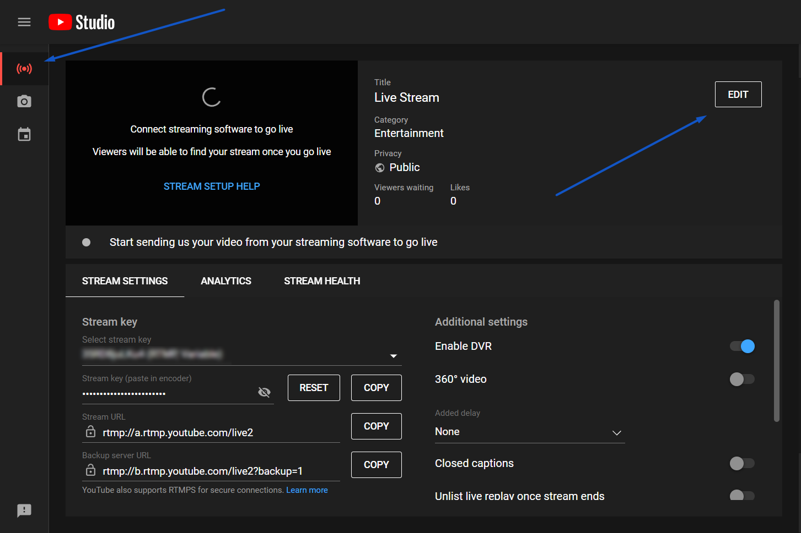
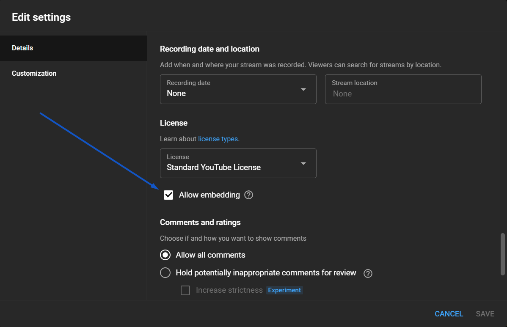
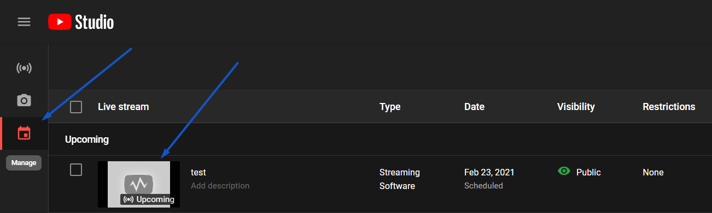
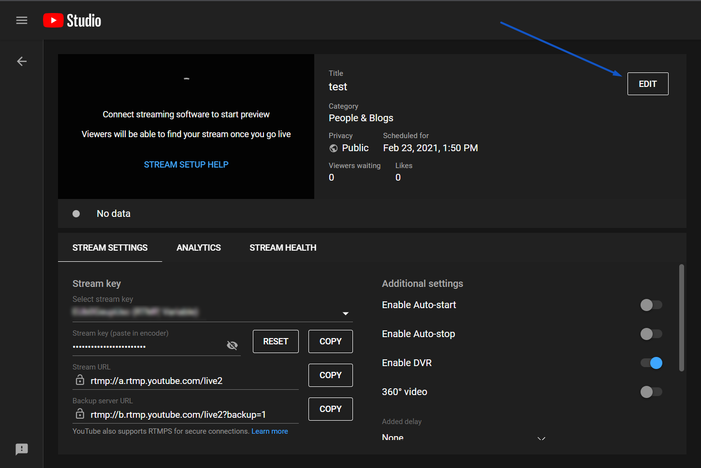

# Enable Embedding for All Future YouTube Broadcasts

Follow these steps if you want to enable embedding for every YouTube broadcast you perform going forward:

1. Go to your YouTube Live Dashboard.
2. Click into the "Stream" tab on the left, and then press the "Edit" button.
   
   

3. Scroll down to the "License" section, and check the "Allow embedding" box.

   

# Allow Embedding for One Specific Broadcast

Follow these steps if you only want to have a specific broadcast be able to be embedded:

1. Go to your YouTube Live Dashboard.
2. Click the "Manage" tab on the left, and click the thumbnail of your broadcast.

   

3. Click the "Edit" button once you get into the stream studio.

   

4. Scroll down to the "License" section, and check the "Allow embedding" box.

   

5. Press the "Save" button to save the setting change, and you can now embed your broadcast!
